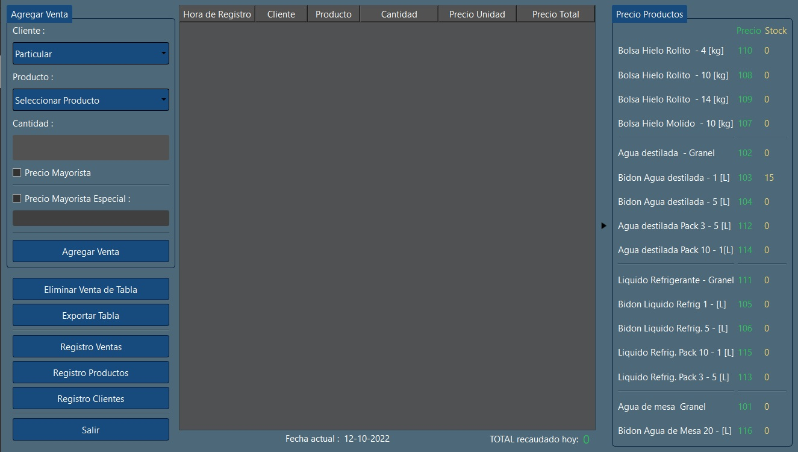
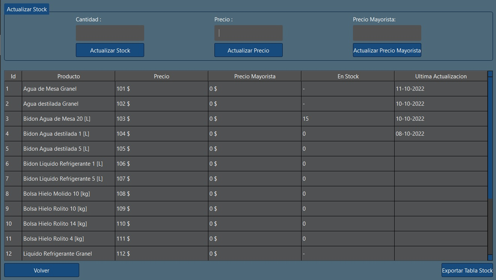
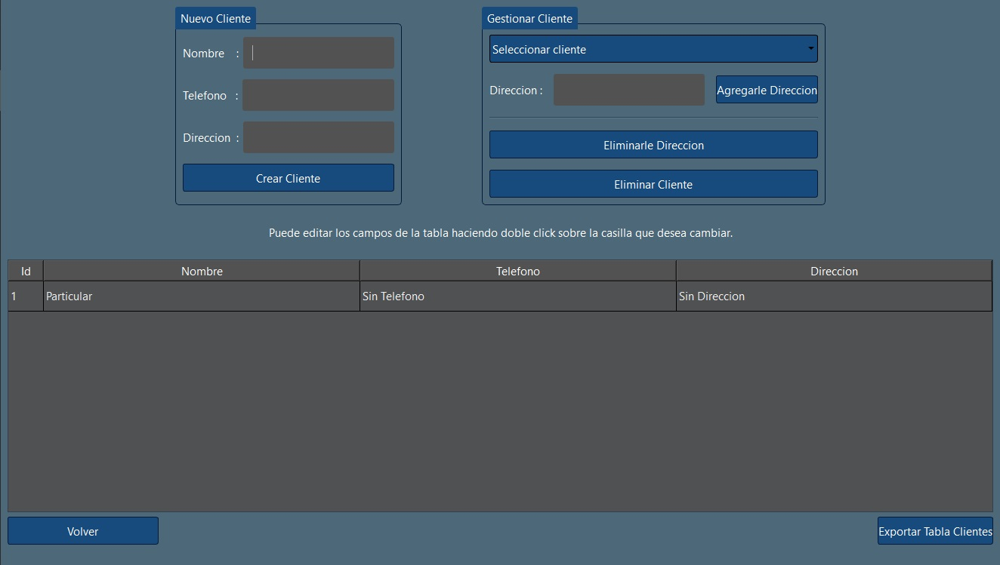
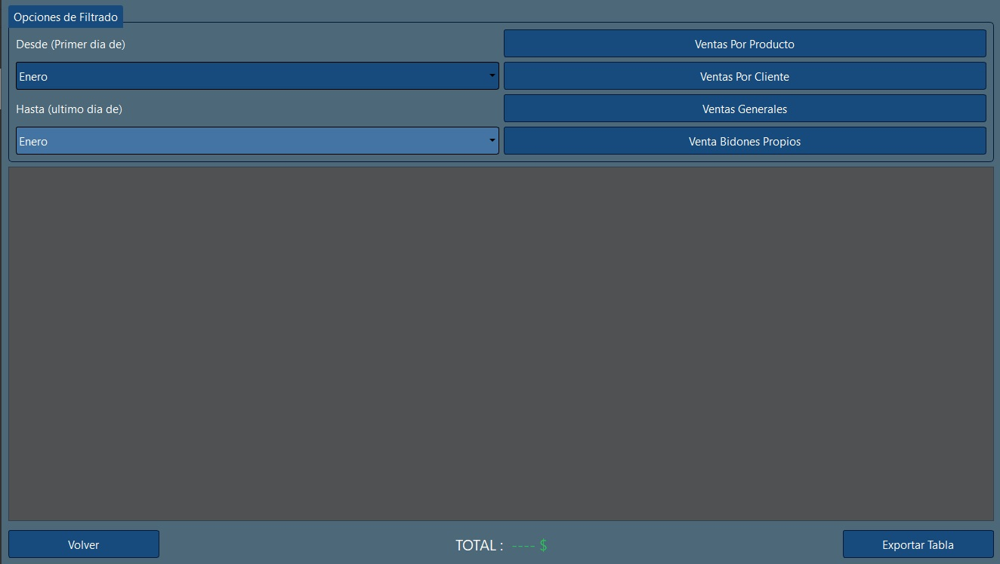
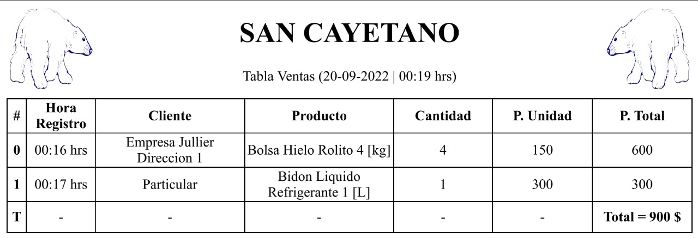

# Sistema para empresa de hielo y agua "San Cayetano" 🧊​​

Proyecto realizado en base a las necesidades planteadas por la empresa.  
  Necesidades: 
  * Mejorar la administración de sus registros en general.
  * Centralizar las anotaciones de las ventas de cada trabajador en un mismo lugar.
  * Acceso y edición facil a los precios de los productos y el stock disponible.
  * Visualización rápida y efectiva de tablas de datos de las ventas a lo largo de ciertos períodos de tiempo.
  * Funcionamiento en Nootebook con Sistema Operativo Windows.

   
  El sistema en definitiva consta de 4 ventanas principales:
   

* Ventana Principal : se anotan las ventas y se accede a las demas ventanas.
* Ventana Clientes : permite registrar-modificar-eliminar clientes
* Ventana Productos : permite modificar el precio-stock de un producto
* Ventana Ventas : permite acceder a las ventas por cliente, ventas por producto y ventas generales mediante un filtrado de tiempo (en meses)

   
  
## 🔎 Sobre el Sistema.

* 💻 Realizado en QT GUI  &nbsp; `C++`  (compilador `MVSC`)

* 🛢 Conexion a base de datos &nbsp; `SQL` , `SQLITE`

* 🌐 Salida PDF realizada en &nbsp; `HTML`  , &nbsp; `CSS`

* 🔧 Implementado con patrón de diseño vista-controlador

 

# Visualizacion general del sistema:

## Ventana Principal

  

##  Ventana Productos

  

##  Ventana Clientes

  

##  Ventana Ventas

  

##  Salida PDF de Ventas del dia

  
  

## 🔎 Qué puedo hacer en el sistema?

* ✔️​ `Agregar` , `Eliminar` , `Actualizar` clientes mediante visualizacion en tabla.
      
      Los Clientes se registran con :  Nombre - Teléfono - Dirección 
      Un mismo cliente puede tener varios telefonos y varias direcciones

* ✔️​ `Actualizar` precio y stock de productos mediante visualizacion en tablas.

      Los Productos se registran con : Nombre - Precio - Stock - Fecha de ultima actualizacion
      
* ✔️​ `Agregar` , `Eliminar` ventas mediante visualización en tabla.

      Las ventas se registran con : Fecha - Hora - Cliente - Producto - Cantidad - Precio Unidad - Precio Total
      
* ✔️​ `Visualizar` diferentes tipos de tablas de ventas en periodos de tiempo.

      Tabla ventas por cliente.
      Tabla ventas por producto.
      Tabla ventas generales.
      

## 💎 Cosas que veo para mejorar

1. No todas las exportaciones de tabla a PDF fueron implementadas.

2. Conectividad con alguna app para movil que permita cargar venta cuando se hacen repartos.

3. Transportar la base de datos a un servidor para mejorar los backup

      * Base de datos actualmente implementada en local por falta de recursos

4. Podrían mejorarse el diseño logico de algunas implementaciones.

